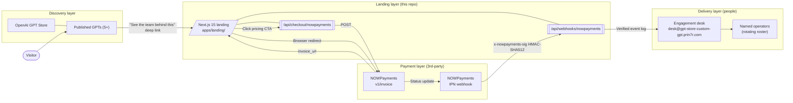

# 02 — Architecture

## System overview

After-the-Store is a **landing-only** marketing site that converts OpenAI-GPT-Store visitors into engagement requests. It does not host any user accounts, store any user data beyond webhook logs, or run any heavyweight services. The architecture is intentionally minimal — every component answers a single, well-bounded question.

## Components

### `apps/landing/` — Next.js 15 (App Router)

- React 19 server components by default. Only `components/pricing-cta.tsx` is a client component (it needs `useState` for the busy lock and `window.location.href` for the redirect).
- Tailwind 3.4 with brand tokens defined in `tailwind.config.ts`.
- Build output: standalone (`next.config.mjs` → `output: 'standalone'`).
- Static + dynamic mix: the entire landing page is statically rendered at build time. The two API routes are `runtime: 'nodejs'`, `dynamic: 'force-dynamic'`.

### `app/api/checkout/nowpayments/route.ts`

- **POST** body: `{ "plan": "engagement" | "subscription" | "concierge" }`.
- Validates plan id; calls `createNowpaymentsInvoice` from `lib/nowpayments.ts`.
- Returns `{ mode: "live", plan, setup_usd, invoice_id, invoice_url }` on success.
- HTTP 503 on missing env (operator gap), 502 on upstream errors, 400 on unknown plan.

### `app/api/webhooks/nowpayments/route.ts`

- **POST**. Reads raw body, parses JSON, verifies `x-nowpayments-sig` HMAC-SHA512.
- HMAC algorithm: `crypto.createHmac("sha512", secret).update(JSON.stringify(sortObject(payload))).digest("hex")`. Identical to `payments-prototypes/src/lib/signatures.ts`.
- Logs verified events under `[TRANSCRIPT_NOWPAYMENTS_IPN]` to journalctl on the deploy host.
- No DB write at this layer — order persistence is deferred to a later wave when `apps/app/` ships.

### `lib/nowpayments.ts`

- `PLANS` — the canonical mapping of plan id → name + setup USD + monthly USD + description. Source of truth for both the pricing UI labels and the `order_description` sent to NOWPayments.
- `createNowpaymentsInvoice` — wraps `POST /v1/invoice`, returns `{ id, invoice_url, raw }`.
- `verifyNowpaymentsIpn` — pure function, `(payload, signature, secret) → boolean`. Timing-safe.

### `lib/env.ts`

- `optionalEnv` / `requiredEnv` / `MissingEnvError`.
- `appUrlFromRequest` — picks `NEXT_PUBLIC_SITE_URL`, falls back to `NEXT_PUBLIC_APP_URL`, then to `request.url`'s origin.

## Data flows

### Visitor → engagement (happy path)

1. Visitor opens a published GPT in the OpenAI Store.
2. The GPT answers their question, then suggests the After-the-Store deep link in its closing message.
3. Browser navigates to `https://gpt-store-custom-gpt.prin7r.com`.
4. Visitor reads the hero, transcript card, "what our GPTs do today," and "why click through."
5. At pricing, visitor clicks one of three NOWPayments CTAs.
6. `PricingCta` posts to `/api/checkout/nowpayments` with the plan id.
7. Server creates a NOWPayments invoice, returns `invoice_url`.
8. Browser redirects to NOWPayments hosted page.
9. Visitor pays in USDT/USDC (or via fiat partner card on-ramp).
10. NOWPayments POSTs status updates to `/api/webhooks/nowpayments`. We verify the signature and log.
11. Engagement desk receives a heads-up via journalctl alerts; named operator emails the visitor within one business day to begin.

### Visitor → no payment (escape hatch)

If `NOWPAYMENTS_API_KEY` is unset (e.g., on a fresh deploy before the operator has wired secrets), the checkout endpoint returns HTTP 503 with a polite "email the desk" message. The CTA renders this inline beneath the button. No invoice is half-created.

## Deploy topology

- **Host.** `storage-contabo` (root@161.97.99.120).
- **Working dir.** `/opt/prin7r-deploys/gpt-store-custom-gpt/`.
- **Reverse proxy.** dokploy-traefik runs in host network mode with `exposedByDefault=false`. The compose file labels the container with the host rule, websecure entrypoint, and `letsencrypt` cert resolver.
- **Networking.** No `dokploy-network` block. Traefik discovers the container via `/var/run/docker.sock` and routes via the bridge IP.
- **Secrets.** `.env` placed manually on the host at `/opt/prin7r-deploys/gpt-store-custom-gpt/.env`, gitignored. Compose mounts via `env_file: .env`.
- **DNS.** `*.prin7r.com → 161.97.99.120` wildcard (already provisioned). No per-subdomain record.
- **TLS.** HTTP-01 challenge via the shared `letsencrypt` resolver. Auto-renewal handled by traefik.
- **Logs.** `docker logs gpt-store-custom-gpt-landing` for container logs; journalctl on the host for IPN audit.

## Security boundaries

- The `x-api-key` for NOWPayments lives only in env. Never logged. Never echoed in error messages.
- IPN payloads are never trusted before signature verification. A 401 is returned (and no log line written) when the signature fails — to keep journalctl noise low against random scanners.
- The landing page itself does not store visitor input. There is no contact form, no newsletter signup, no analytics beyond the host's access logs.
- HTTPS-only. HSTS via traefik defaults.

## Future expansion

- `apps/app/` (Wasp / Open-SaaS) — when full account creation arrives, persist orders via the IPN handler.
- `apps/api/` (Bun + Hono) — only added if a control-plane API is needed for operator tooling.
- Plisio + Reown direct-wallet — wired but quieted in v0.1; promote to live CTAs in a follow-up polish pass.
